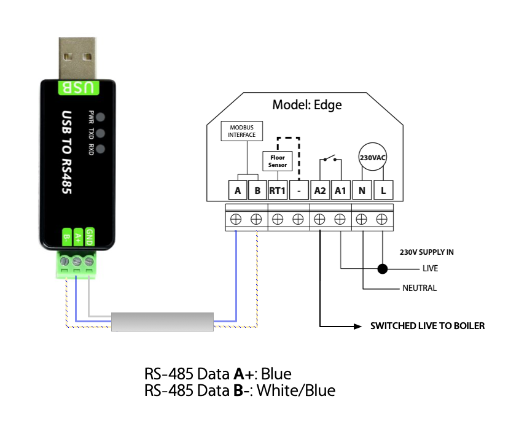

node-heatmiser-modbus
=====================

node.js library and command line tool for controlling [Heatmiser] Modbus Thermostats.

It has been tested with the following devices:
* [Heatmiser Edge]
* [Heatmiser Touch-E v2]


Installation
------------

To install in your local project:
```sh
npm install heatmiser-modbus
```

Or to install globally and make easy use of the `hmmb` command line tool:
```sh
npm install -g heatmiser-modbus
```


Wiring
------

To connect a Heatmiser Modbus Thermostat to a computer, you need a RS-485 adaptor.



I initially had some trouble with connecting using a short (1m) cable during testing, until I discovered that the termination resistor in the Heatmiser Edge had to be switched *off* for short distances.

The following RS-485 interfaces have been tested with:
* [Waveshare USB to RS485 Bidirectional Converter](https://www.waveshare.com/product/iot-communication/wired-comm-converter/usb-to-rs485.htm)
* [Waveshare USB to RS232/485/TTL Converter](https://www.waveshare.com/product/iot-communication/wired-comm-converter/usb-to-rs232-uart-fifo/usb-to-rs232-485-ttl.htm?sku=15817)

There are some very expensive industrial RS-485 interfaces out there.
But I have found [Waveshare](https://www.waveshare.com/) to be a good balance between cost and quality.


Command Line Tool
-----------------

The `hmmb` command line tool is provided to configure and control thermostats, without having to write any JavaScript.

Two things are required to use the tool:
* The path to the serial port, that the modbus devices are connected to
* The Unit Identifier (aka Communications ID) of the thermostat to talk to

These can be provided as command line options, or via environment variables.
If the Modbus Unit Identifier is not given, it defaults to 1.

```
Usage: hmmb [options] [command]

Tool for controlling Heatmiser Modbus Thermostats

Options:
  -V, --version                      output the version number
  -d, --device <port>                The serial port device to connect to (eg /dev/ttyUSB0) (env: HMMB_DEVICE)
  -i, --id <num>                     The Communications ID of the device to control (1-32) (default: 1, env: HMMB_ID)
  -h, --help                         display help for command

Commands:
  get-status                         Display thermostat status (including current temperatures)
  turn-on                            Turn on the thermostat
  turn-off                           Turn off the thermostat
  hold <temp> <hours:mins>           Set a different temperature for a desired duration
  set-temperature <temp>             Set the target room temperature
  set-floor-limit <temp>             Set the temperature limit for the floor sensor
  set-frost-temperature <temp>       Set the frost protection temperature (7-17 °C)
  set-switching-differential <temp>  Set the thermostat switching differential (in °C)
  set-output-delay <minutes>         Set time in minutes to delay output switching by
  set-up-down-limit <limit>          Set a limit on the use of the up and down keys
  set-sensors <mode>                 Set the sensor selection mode. See extended help for values.
  set-programme-periods <periods>    Set the number of programme periods for each day
  set-programme-mode <mode>          Set the type of programme / schedule mode. See extended help for details.
  set-units <units>                  Set the temperature units used by the thermostat
  set-time                           Sync the system clock to the thermostat
  set-auto-dst <on or off>           Enable or disable automatic adjustment for Daylight Saving Time
  set-keylock <pin>                  Set a PIN to lock the keypad with
  factory-reset                      Restore thermostat to the default factory settings
  help [command]                     display help for command
```


Some of the commands have additional help text, for example:
```
$ hmmb help set-programme-mode  
Usage: hmmb set-programme-mode [options] <mode>

Set the type of programme / schedule mode. See extended help for details.

Arguments:
  mode        the programme mode number or name

Options:
  -h, --help  display help for command

Programme modes:
  0   5day_2day   One schedule for weekdays, another for weekends (Default)
  1   7day        Different schedule for each day of the week
  2   24hour      Same schedule every day
  3   none        Non-Programmable - temperature control only
```

License
-------

`node-heatmiser-modbus` is licensed under the terms of the MIT license.
See the file [LICENSE](/LICENSE.md) for details.

This software is independently written and maintained and is not supported by Heatmiser UK Limited.


Contact
-------

* Author:    Nicholas J Humfrey
* Twitter:   [@njh](http://twitter.com/njh)


[Heatmiser]:             https://www.heatmiser.com/
[Heatmiser Edge]:        https://www.heatmiser.com/en/modbus-thermostat-series/
[Heatmiser Touch-E v2]:  https://www.heatmiser.com/en/touchscreen-series/
